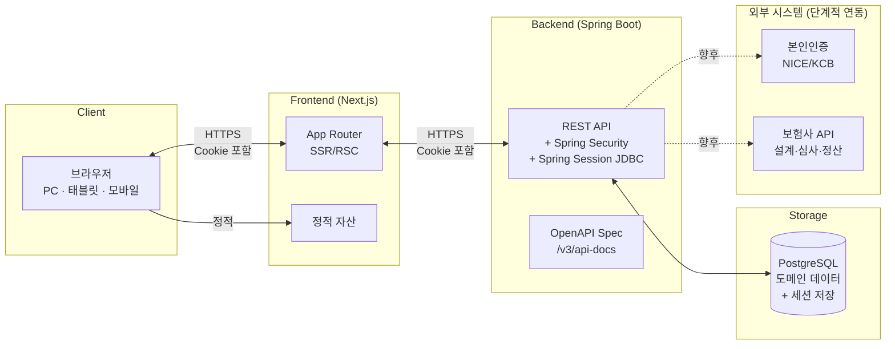
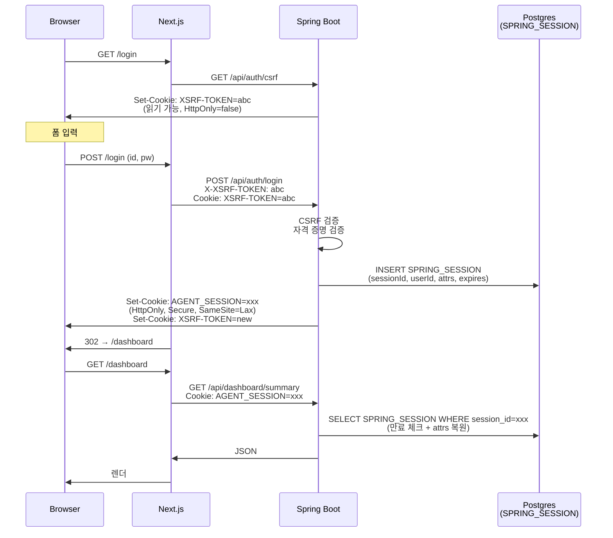
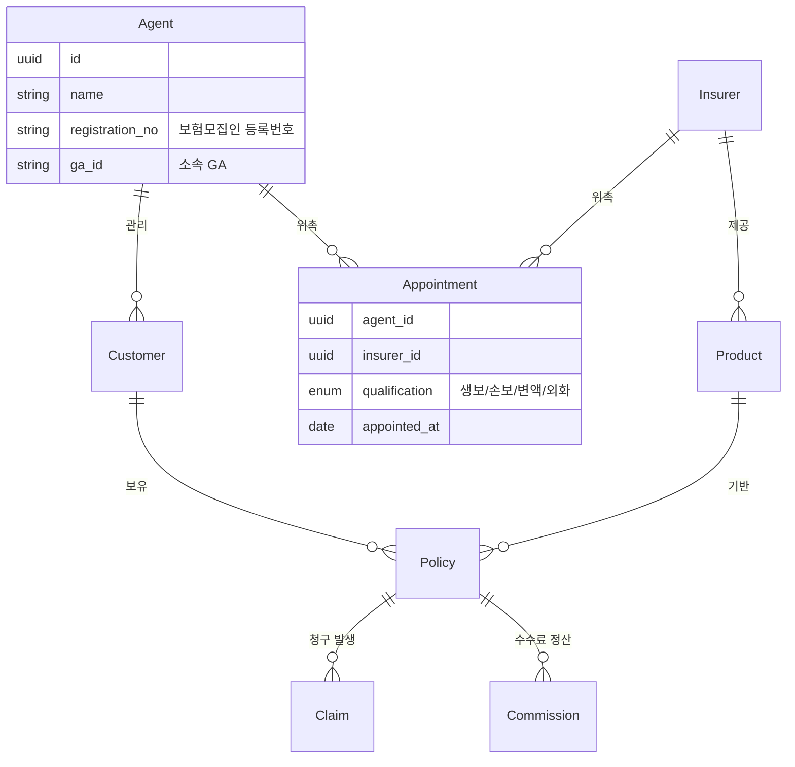

# ARCHITECTURE.md

> AgentSupport 시스템 아키텍처 단일 출처.
> 새 기능을 설계하거나 인프라를 변경할 때 본 문서를 먼저 읽고, 의사결정은 9장 ADR 로그에 기재한다.
>
> 본 문서는 `AGENTS.md`의 결정사항을 구조로 펼친 것이다. 두 문서가 충돌하면 `AGENTS.md`가 우선.

---

## 1. 시스템 개요



**핵심 원칙**
- **FE/BE 명확 분리**: Next.js는 UI와 BFF(필요 시) 역할만. 비즈니스 로직은 모두 Spring Boot.
- **세션은 Postgres에 저장** (Spring Session JDBC): 서버 재시작·스케일 아웃 가능, 데이터 단일 원천(Supabase Seoul), 감사 친화. 트래픽 급증 시 Redis로 전환 검토 가능 (`tech-debt-tracker.md`).
- **외부 시스템은 단계적 연동**: MVP는 mock + DB만. 본인인증·보험사 API는 별도 plan.

---

## 2. 리포지토리 구조

```
agentsupport/
├── frontend/                     # Next.js 앱
│   ├── src/
│   │   ├── app/                  # App Router
│   │   ├── components/           # 재사용 컴포넌트
│   │   ├── features/             # 기능 단위 묶음
│   │   ├── lib/                  # 공통 유틸
│   │   ├── api/                  # OpenAPI 생성된 클라이언트 (수동 편집 금지)
│   │   └── styles/
│   ├── public/
│   ├── tests/
│   │   ├── unit/                 # Vitest
│   │   ├── e2e/                  # Playwright
│   │   ├── visual/               # Playwright 시각 회귀
│   │   └── fixtures/
│   │       └── korean-edge-cases.ts
│   ├── package.json
│   ├── tailwind.config.ts
│   ├── tsconfig.json
│   └── next.config.ts
│
├── backend/                      # Spring Boot 앱
│   ├── src/
│   │   ├── main/
│   │   │   ├── java/com/agentsupport/
│   │   │   │   ├── auth/         # 인증·인가
│   │   │   │   ├── customer/     # 고객 도메인
│   │   │   │   ├── policy/       # 계약 도메인
│   │   │   │   ├── claim/        # 청구 도메인
│   │   │   │   ├── common/       # 공통 (예외, DTO 베이스, 유틸)
│   │   │   │   └── config/       # 설정 (Security, CORS, Redis)
│   │   │   └── resources/
│   │   │       ├── application.yml
│   │   │       └── db/migration/ # Flyway 마이그레이션
│   │   └── test/
│   ├── build.gradle.kts
│   └── settings.gradle.kts
│
├── docs/                         # 공유 문서 (FE/BE 모두 참조)
│   ├── design-docs/
│   ├── exec-plans/
│   │   ├── active/
│   │   ├── completed/
│   │   └── tech-debt-tracker.md
│   ├── generated/                # 자동 생성 (수동 편집 금지)
│   │   ├── db-schema.md
│   │   └── openapi.yaml
│   ├── product-specs/
│   ├── references/
│   ├── API.md
│   ├── BACKEND.md
│   ├── DESIGN.md
│   ├── FRONTEND.md
│   ├── PLANS.md
│   ├── PRODUCT_SENSE.md
│   ├── QUALITY_SCORE.md
│   ├── RELIABILITY.md
│   └── SECURITY.md
│
├── scripts/                      # 공통 자동화 (CI 등에서 호출)
│   ├── sync-openapi.sh           # BE 생성 → FE 코드 생성
│   └── check-tokens.sh
│
├── .github/workflows/            # CI/CD
│   ├── frontend.yml
│   ├── backend.yml
│   └── openapi-sync.yml
│
├── docker-compose.yml            # 로컬 dev: PostgreSQL + Redis
├── .gitignore
├── AGENTS.md
├── ARCHITECTURE.md
└── README.md
```

**경로 규칙**
- 모든 공유 문서는 `docs/` (루트 ALL_CAPS .md만 진짜 루트).
- 자동 생성 산출물은 `docs/generated/`에만 존재. 다른 곳에 복사 금지.
- FE의 `src/api/`는 `docs/generated/openapi.yaml` → `pnpm api:generate`로 생성. 수동 편집 금지.

---

## 3. 요청 흐름

### 3.1 일반 API 호출

```
[브라우저]
   │  GET /dashboard/customers
   ↓
[Next.js App Router]
   │  (RSC) 서버 컴포넌트가 BE에 직접 요청
   │  Cookie: AGENT_SESSION=...; XSRF-TOKEN=...
   ↓
[Spring Boot]
   │  SecurityFilterChain → 세션 검증 (Redis 조회)
   │  → CSRF 토큰 검증 (POST/PUT/PATCH/DELETE만)
   │  → Controller → Service → Repository
   ↓
[PostgreSQL]
   │  조회 결과
   ↑
[Spring Boot] → JSON 응답
   ↑
[Next.js] → RSC 렌더링 결과 또는 클라이언트 fetch 응답
   ↑
[브라우저]
```

### 3.2 환경별 호스트

| 환경 | FE | BE | DB + 세션 | Cookie 전략 |
|---|---|---|---|---|
| local | http://localhost:3000 | http://localhost:8080 | Supabase (Seoul) | `SameSite=Lax` (same site) |
| dev/preview | `*.vercel.app` | `*.onrender.com` | Supabase | `SameSite=None; Secure` (cross-origin) ⚠️ |
| prod (목표) | `app.agentsupport.kr` | `api.agentsupport.kr` | Supabase | `SameSite=Lax`, Domain `.agentsupport.kr` |

> ⚠️ **cross-origin cookie 주의**: 커스텀 도메인 확보 전까지 dev/preview에서는 `*.vercel.app`과 `*.onrender.com`이 다른 eTLD+1이라 `SameSite=None; Secure` 사용. 이건 보안 약화 + 일부 브라우저(Safari ITP)에서 차단 가능. **운영 진입 전 커스텀 도메인 확보 필수** (`docs/exec-plans/tech-debt-tracker.md` 참조).

---

## 4. 인증 플로우

### 4.1 로그인 시퀀스



> Spring Session JDBC가 `SPRING_SESSION`, `SPRING_SESSION_ATTRIBUTES` 두 테이블을 Flyway 외부에서 자동 생성. (또는 `@EnableJdbcHttpSession`의 schema 옵션으로 명시.)

### 4.2 CSRF 토큰 처리

세션 쿠키 기반 → CSRF 공격면이 살아 있어서 **반드시 CSRF 토큰 검증 필요**.

- **백엔드**: `CookieCsrfTokenRepository.withHttpOnlyFalse()` 사용. `XSRF-TOKEN` 쿠키 발급.
- **프론트엔드**: 모든 변경 요청(POST/PUT/PATCH/DELETE)에 `X-XSRF-TOKEN` 헤더를 자동 추가하는 fetch wrapper 구현.
- **헬퍼**: `frontend/src/lib/api/csrf.ts`에 토큰 읽기·헤더 추가 유틸. 모든 mutating fetch는 이 wrapper를 거친다.

### 4.3 세션 정책

| 항목 | 값 | 근거 |
|---|---|---|
| 세션 TTL (idle) | 30분 | 금융권 표준 |
| 세션 TTL (absolute) | 8시간 | 영업일 1회 로그인 가정 |
| "로그인 상태 유지" 시 | 14일 (rolling) | 모바일 사용성 |
| 동시 세션 | 최대 2개 (PC + 모바일) | 추가 로그인 시 가장 오래된 것 만료 |
| 세션 ID 회전 | 로그인 직후 1회 | 세션 고정 공격 방지 |
| 저장소 | Postgres (Spring Session JDBC, `SPRING_SESSION` 테이블) | 데이터 단일 원천, 감사 친화. 트래픽 급증 시 Redis 전환 검토. |

---

## 5. API 컨트랙트 동기화

```
[backend/src/.../*Controller.java]
       │ (springdoc-openapi 어노테이션)
       ↓
[./gradlew openApiGenerate]
       ↓
[docs/generated/openapi.yaml]   ← 커밋 대상
       ↓ (CI에서 변경 감지)
[frontend/ pnpm api:generate]
       ↓
[frontend/src/api/*.ts]         ← 자동 생성, 수동 편집 금지
       │ (타입 + fetch 클라이언트)
       ↓
[features/customer/.../use-customer-list.ts]
       │ (TanStack Query로 래핑)
       ↓
[컴포넌트에서 사용]
```

**규칙**
- 새 엔드포인트는 **BE 먼저**. `docs/API.md`의 컨벤션 따라 설계 → 코드 작성 → OpenAPI 갱신.
- FE는 BE PR 머지 후 `pnpm api:generate`로 동기화.
- CI에서 `openapi.yaml` 변경이 감지되면 FE 빌드를 자동 트리거하여 타입 불일치 조기 발견.
- BE에서 breaking change가 필요하면 별도 plan + ADR.

---

## 6. CORS, 쿠키, 보안 헤더

### 6.1 CORS

**local dev** (`localhost:3000` ↔ `localhost:8080`):
```java
// backend/.../config/SecurityConfig.java (개요)
CorsConfiguration cors = new CorsConfiguration();
cors.setAllowedOrigins(List.of("http://localhost:3000"));
cors.setAllowedMethods(List.of("GET", "POST", "PUT", "PATCH", "DELETE", "OPTIONS"));
cors.setAllowedHeaders(List.of("Content-Type", "X-XSRF-TOKEN"));
cors.setAllowCredentials(true);  // 쿠키 전송에 필수
cors.setExposedHeaders(List.of("Set-Cookie"));
```

**prod (Vercel + Render, 커스텀 도메인 전)**: CORS 필수 + `SameSite=None`. `CORS_ALLOWED_ORIGINS` 환경변수로 Vercel URL 지정.

**prod (커스텀 도메인 후, `app.agentsupport.kr` + `api.agentsupport.kr`)**: 같은 root domain → CORS 여전히 필요 (다른 origin) 하지만 cookie는 `.agentsupport.kr` 도메인으로 통일되어 `SameSite=Lax` 복귀 가능.

### 6.2 쿠키 속성

| 쿠키 | HttpOnly | Secure | SameSite (local) | SameSite (Vercel+Render) | SameSite (custom domain) | 용도 |
|---|---|---|---|---|---|---|
| `AGENT_SESSION` | ✅ | ✅ (prod) | Lax | None ⚠️ | Lax | 인증 세션 |
| `XSRF-TOKEN` | ❌ (FE가 읽어야 함) | ✅ (prod) | Lax | None ⚠️ | Lax | CSRF 토큰 |

> **`SameSite=None` 사용 시 주의**:
> - 반드시 `Secure` 동반 (HTTPS only)
> - CSRF 위험 증가 → CSRF 토큰 검증이 더욱 중요
> - Safari ITP·일부 브라우저 third-party cookie 차단 가능
> - 커스텀 도메인 확보 후 `Lax`로 복귀할 것 (`tech-debt-tracker.md`).

> **주의**: `XSRF-TOKEN`이 HttpOnly가 아닌 이유는 FE가 JS로 읽어서 헤더로 echo해야 하기 때문. XSS 노출은 다른 계층(CSP)에서 방어.

### 6.3 보안 헤더

| 헤더 | 값 |
|---|---|
| `Strict-Transport-Security` | `max-age=31536000; includeSubDomains` |
| `X-Frame-Options` | `DENY` (iframe 임베드 금지) |
| `X-Content-Type-Options` | `nosniff` |
| `Referrer-Policy` | `strict-origin-when-cross-origin` |
| `Content-Security-Policy` | TBD (Tailwind inline style 호환되도록 설계, `docs/SECURITY.md`에서 상세) |
| `Permissions-Policy` | 카메라·마이크·위치 기본 비활성, 본인인증 페이지에서만 활성 |

---

## 7. 데이터 모델 개요

> 상세 스키마는 `docs/generated/db-schema.md`. 본 섹션은 도메인 경계만.



**핵심 GA 특성**:
- `Agent ↔ Insurer`가 N:N (`Appointment` 테이블). 한 설계사가 여러 보험사 위촉.
- `Policy`는 항상 `(Customer, Product, Insurer)` 조합. 보험사별 집계 가능.
- `Commission`은 `Policy` 종속이며 회차(initial/maintenance) 구분.

---

## 8. 배포 아키텍처 (확정)

```
┌─────────────┐     ┌──────────────┐
│   Vercel    │     │    Render    │
│ (Next.js)   │────▶│ (Spring Boot)│
│ Global CDN  │     │ Singapore /  │
│             │     │  Frankfurt   │
└─────────────┘     └──────┬───────┘
                           │
                           ▼
                    ┌─────────────┐
                    │  Supabase   │
                    │ (Postgres)  │
                    │ Seoul AP-NE │
                    │             │
                    │ 도메인 데이터 │
                    │ + 세션 저장  │
                    └─────────────┘
```

### 8.1 각 서비스 역할

| 서비스 | 역할 | 무료 티어 한도 | 유료 전환 트리거 |
|---|---|---|---|
| **Vercel** | Next.js 호스팅, edge CDN | Hobby (개인 비상업) | 상업 사용 시 Pro |
| **Render** | Spring Boot 호스팅 (Web Service) | 750h/월, 15분 비활성 시 cold (재기동 30~60s) | 운영 진입 시 Starter (cold 제거) |
| **Supabase** | PostgreSQL (도메인 + 세션) | 500MB DB, 7일 비활성 시 일시정지 (재활성 즉시) | DB 크기 또는 동시 접속 증가 시 |

### 8.2 환경변수

| 변수 | local (.env) | Render dashboard | Vercel dashboard |
|---|---|---|---|
| `DB_*` | Supabase 직접 | Supabase 직접 | (FE 불요) |
| `CORS_ALLOWED_ORIGINS` | `http://localhost:3000` | `https://<vercel-url>` | (FE 불요) |
| `SPRING_PROFILES_ACTIVE` | `local` | `prod` | (FE 불요) |
| `NEXT_PUBLIC_API_BASE_URL` | `http://localhost:8080` | (BE 불요) | `https://<render-url>` |

> 시크릿(`DB_PASSWORD`)은 git 커밋 금지. `.env`는 `.gitignore`에 박혀 있고, 운영 환경은 Render/Vercel 대시보드 secret 사용.

### 8.3 금융 도메인 제약 검토

- **개인정보 국내 보관 의무**: Supabase Seoul 리전 사용. 도메인 데이터 + 세션 데이터 모두 한국 리전. ✅
- **감사로그 보관 5년 이상**: 별도 archive 전략 필요. MVP 단계 외.
- **데이터 암호화**: Supabase는 at-rest + in-transit 암호화 기본. ✅
- **단일 데이터 출처**: 세션도 같은 Postgres에 저장 → 백업·복구·감사 일원화.

### 8.4 커스텀 도메인 (운영 진입 전 필수)

`app.agentsupport.kr` (Vercel) + `api.agentsupport.kr` (Render) 형태로 같은 root domain 확보 → `SameSite=Lax` 복귀. 자세한 cookie 정책은 6.2 참조.

### 8.5 Redis 도입 재평가 트리거

세션 스토어가 Postgres인 한계점:
- 매 요청마다 DB 쿼리 (인덱싱 적용 시 ~1ms, 큰 부담 아님)
- 대규모 동시 접속 시 DB 부하 증가
- 세션 쓰기 트래픽이 도메인 쓰기와 같은 connection pool 공유

**Redis 도입 검토 시점**:
- 동시 접속자 1,000명 초과
- 평균 응답 시간 > 100ms 중 세션 쿼리가 > 30% 차지
- 다중 BE 인스턴스 운영 시작

→ `tech-debt-tracker.md`에 모니터링 항목 등록.

---

## 9. 의사결정 로그 (ADR)

### ADR-001: 백엔드 언어 = Java 21 LTS
- **결정일**: 2026-05-18
- **상태**: Accepted
- **맥락**: GA 보험설계사 플랫폼. 한국 금융권 호환성, 라이브러리 풍부함, 팀 채용 용이성 고려.
- **결정**: Java 21 LTS + OpenJDK. 벤더는 추후 결정.
- **근거**:
  - Spring Boot 3.x와 완벽 호환, virtual thread·record·pattern matching 등 최신 기능 활용.
  - 한국 금융권 라이브러리(NICE/KCB 인증, 보험사 EDI) Java SDK 우선.
  - Kotlin도 후보였으나, 팀 채용·기존 코드베이스 호환성에서 Java가 안정적.
- **결과**:
  - Lombok 사용 결정 필요 (`docs/BACKEND.md`에서 정의).
  - record 적극 활용 권장 (DTO).
  - null 안전성은 Optional + Bean Validation으로 보강.

### ADR-002: 리포지토리 구조 = 단일 레포 + `/frontend` + `/backend` 폴더
- **결정일**: 2026-05-18
- **상태**: Accepted
- **맥락**: 초기 단계. FE/BE 동시 변경 PR이 빈번 (특히 API 컨트랙트 변경).
- **결정**: 단일 GitHub 레포에 `/frontend`, `/backend`, `/docs` 폴더 분리.
- **근거**:
  - PR 하나로 FE+BE 변경 가능 → 컨트랙트 동기화 검증 용이.
  - 공유 `docs/` 단일 출처 유지.
  - CI 분리는 path filter로 충분.
- **결과**:
  - GitHub Actions workflow 분리 (`frontend.yml`, `backend.yml`, `openapi-sync.yml`).
  - 향후 팀 규모 커지면 분리 레포로 전환 검토 (재평가 시점: 풀타임 개발 5명 이상).

### ADR-003: 인증 방식 = Session 쿠키 (Spring Security + Spring Session JDBC)
- **결정일**: 2026-05-18 (2026-05-18 갱신: 저장소를 Redis → Postgres로 변경)
- **상태**: Accepted
- **맥락**: 금융권 보안 표준, 모바일/PC 혼합 사용, 동시 세션 제어 필요.
- **결정**: Spring Security 기본 세션 + **Spring Session JDBC**로 Supabase Postgres에 저장 + HttpOnly Secure 쿠키 + CSRF 토큰.
- **근거**:
  - JWT 대비 서버 측 강제 무효화 가능 (분실·도용 대응).
  - 동시 세션·이상 탐지 기능 표준 제공.
  - 모바일 PWA도 쿠키 정상 동작 (네이티브 앱 추가 시 재평가).
  - **JDBC 선택 이유**: 외부 Redis 서비스 추가 없음, 데이터 단일 원천(Supabase Seoul), 백업·감사 일원화. MVP 트래픽에선 성능 차이 미미.
- **결과**:
  - `spring-session-jdbc` 의존성 + `application.yml`의 `spring.session.store-type: jdbc`.
  - Spring Session JDBC가 `SPRING_SESSION`, `SPRING_SESSION_ATTRIBUTES` 테이블 자동 관리.
  - FE에 CSRF 토큰 echo wrapper 구현 필수 (`frontend/src/lib/api/csrf.ts`).
  - 향후 네이티브 모바일 앱 추가 시 OAuth2 Authorization Code + PKCE로 확장 검토.
  - 커스텀 도메인 확보 전까지 cross-origin → `SameSite=None; Secure` 사용 (ADR-005 참고).
  - 트래픽 증가 시 Redis 도입 검토 (ARCHITECTURE.md 8.5 참고).

### ADR-005: 배포 = Vercel(FE) + Render(BE) + Supabase(Postgres + 세션)
- **결정일**: 2026-05-18
- **상태**: Accepted
- **맥락**: MVP 단계. 운영 진입까지의 시간을 짧게. 로컬 dev 도구 설치 부담 최소화. 외부 서비스 수 최소화.
- **결정**: 3개 무료 티어 서비스 조합. Docker 로컬 미사용. 별도 Redis 없음.
- **근거**:
  - Vercel: Next.js 호스팅 표준, GitHub 자동 배포.
  - Render: Spring Boot Web Service 직접 지원, Buildpack 자동 감지.
  - Supabase: 한국(Seoul) 리전 제공, 도메인 데이터 + 세션 모두 단일 저장소.
  - 별도 Redis 미도입: 외부 서비스 수 줄이고 데이터 단일 원천 유지 (ADR-003 참고).
- **결과**:
  - `.env.example` 추가, `.env`로 비밀 관리.
  - `docker-compose.yml` 미사용.
  - **cross-origin cookie 이슈** 발생 → `SameSite=None; Secure` 임시 사용, 커스텀 도메인 확보 시 `Lax` 복귀.
  - **Render free tier cold start**: 15분 비활성 시 30~60s cold. dev 단계에서 첫 요청 지연 인지 필요. 운영 진입 시 Starter 플랜 (~$7/월) 전환.
  - **Supabase 7일 비활성 일시정지**: dev가 일주일 이상 멈추면 재활성화 클릭 필요. 데이터는 유지.

### ADR-004: ORM = JPA (Spring Data JPA / Hibernate)

- **결정일**: 2026-05-19
- **상태**: Accepted
- **맥락**: 첫 도메인 모델(Policy, Commission) 작성 전 ORM을 확정해야 함.
- **결정**: **Spring Data JPA** (이미 `build.gradle.kts`에 포함됨)
- **근거**:
  - 이미 `spring-boot-starter-data-jpa`가 의존성에 포함되어 있어 별도 전환 비용 없음.
  - Spring Data Repository 패턴으로 CRUD 보일러플레이트 최소화 → 개발 속도 우위.
  - JPQL / Specification / QueryDSL로 복잡 쿼리 대응 가능.
  - 복잡한 Raw SQL이 필요한 경우 `@Query` 네이티브 쿼리로 escape 가능.
- **결과**:
  - `spring.jpa.hibernate.ddl-auto: validate` 유지 (스키마는 Flyway가 관리).
  - Entity 클래스는 `@Entity` + `@Table`로 명시. `@Column` 이름은 snake_case로 명시.
  - N+1 방지: `@EntityGraph` 또는 fetch join 명시 원칙.
  - DB 스키마 변경은 Flyway 마이그레이션으로만 (`db/migration/V*.sql`).

### ADR 추가 예정

- ADR-006: 본인인증 SDK
- ADR-007: 디자인 폰트 (Pretendard 채택 시 정식 기재)
- ADR-008: 커스텀 도메인 확보 및 cookie 정책 정상화
- ADR-009: Redis 도입 (트래픽 임계점 도달 시)
